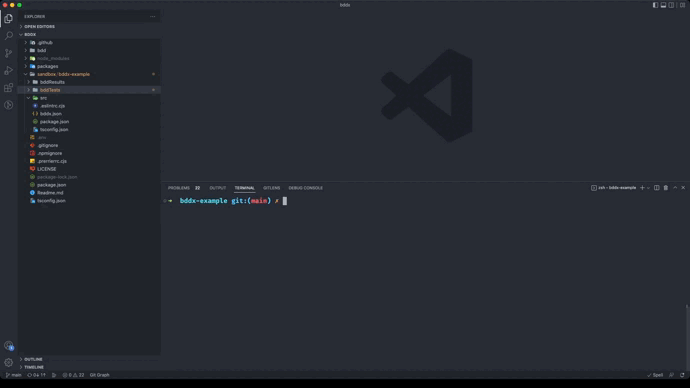

# BDDx [](https://www.npmjs.com/package/bddx) [](https://www.npmjs.com/package/bddx) [](https://github.com/aexol-studio/bddx)

Run Behavior-Driven Development tests inside a CLI




### What is BDDx?

- Write tests in Gherkin, Cucumber's simply structured plain-text language
- Upload BDD test files in bulk,
- Run tests to execute them line by line for all your files
- Get a detailed summary on **what** failed and **why**
- Failed tests can be made to automatically result in a Jira task or Github issue to automate the fixing process

# Downloads:

## <span class="buttons-wrapper">[](https://github.com/aexol-studio/bddx) [](https://github.com/aexol-studio/bddx/tree/main/packages/bddx-core)</span>


## CLI commands:


### Installation and initialization:

| Description | Command |
| --- | --- |
| to install BDDx: | `npm i bddx` |
| to initialize BDDx (with optional Jira integration): | `npx bddx init` |
| to initialize only BDDx Jira integration without changing the basic configuration: | `npx bddx jiraInit` |
| to check if the Jira API token is working correctly<sup>1</sup> : | `npx bddx checkToken`

<sup>1</sup>If there's a problem with the loop BDDx will ask the user to provide the correct token value.

### Config file:
After initializing the config file contains:

```
{
  "in": "./bddx/tests",
  "out": "./bddx/results",
}
```

or when Jira is integrated:

```
{
   "in": "./bddx/tests",
   "out": "./bddx/results",
    "organizationName": "organizationName.atlassian.net",
    "projectName": "ProjectName",
    "issueTypeName": "TASK"
}
```

- in: string - input folder with the test files, **(default: "./bddx/tests")**
- out: string - output folder where the test result files are saved, **(default: "./bddx/results")**

The e-mail and Jira API token are saved locally on the machine to ensure safety!

### Running tests

| Description | Command |
| --- | --- |
| to run all .feature tests and save results in a file in the output directory: | `npx bddx` |
| to run all .feature tests and create a task for each failed one on the configured Jira: | `npx bddx jira` |
|to select an unfinished session and continue the tests from that point (you will also be asked about Jira usage): | `npx bddx continue` |


#### [Readme CORE](https://github.com/aexol-studio/bddx/blob/main/Readme.md)

## Roadmap

- [x] 2 test scenarios: display test & pass or fail test
- [x] Jira plugin
- [ ] GitHub plugin

